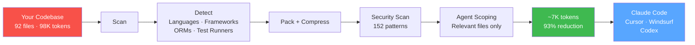
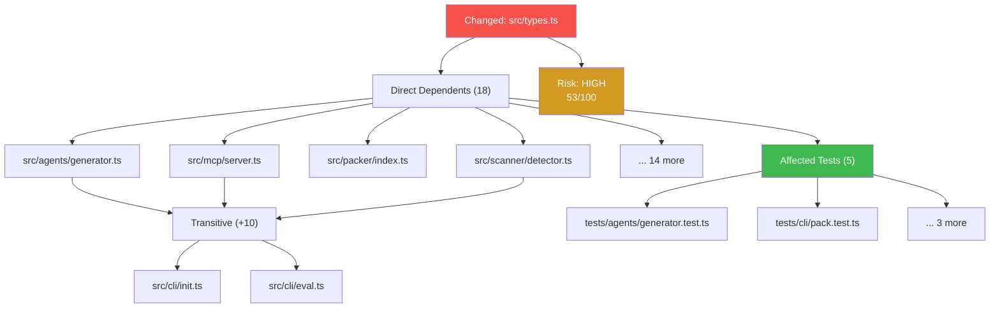
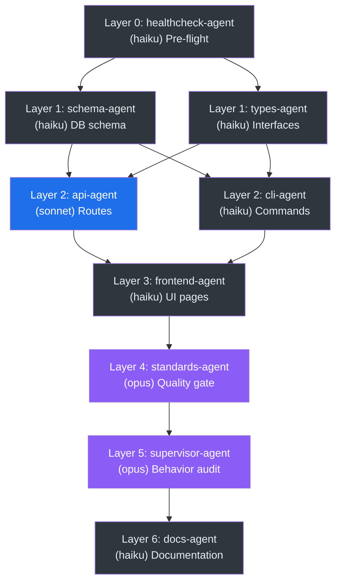
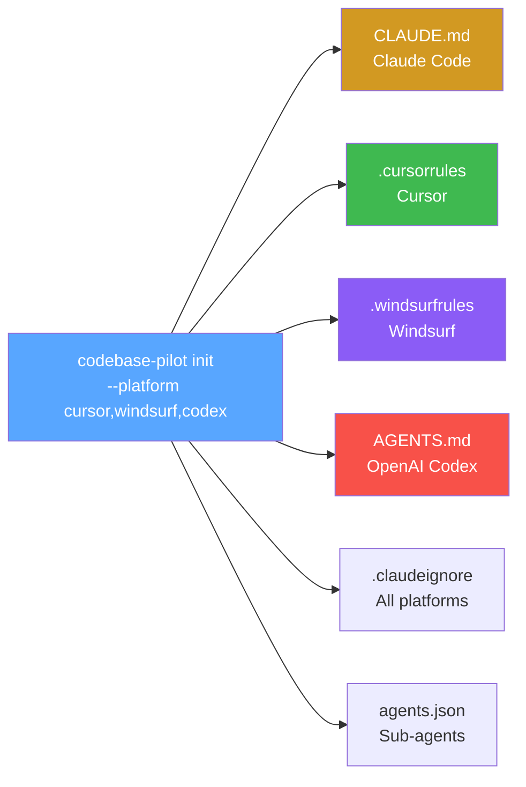
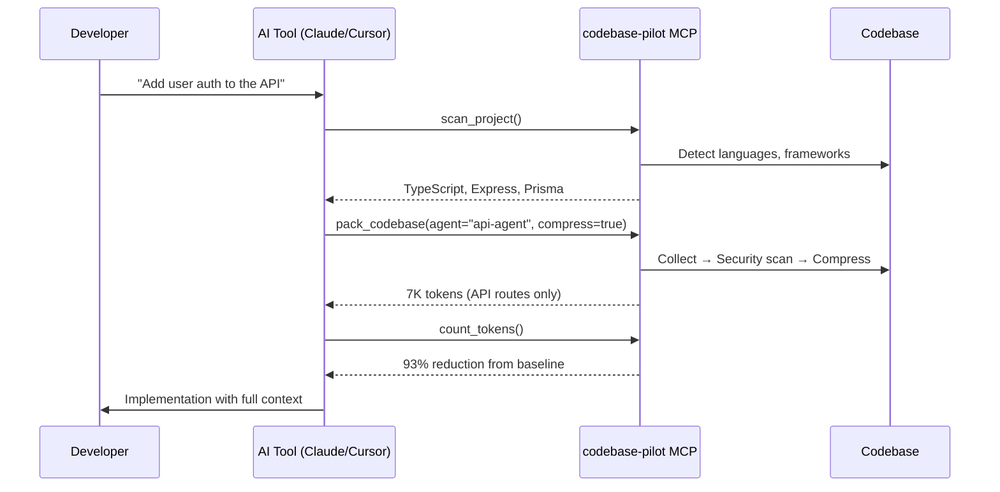
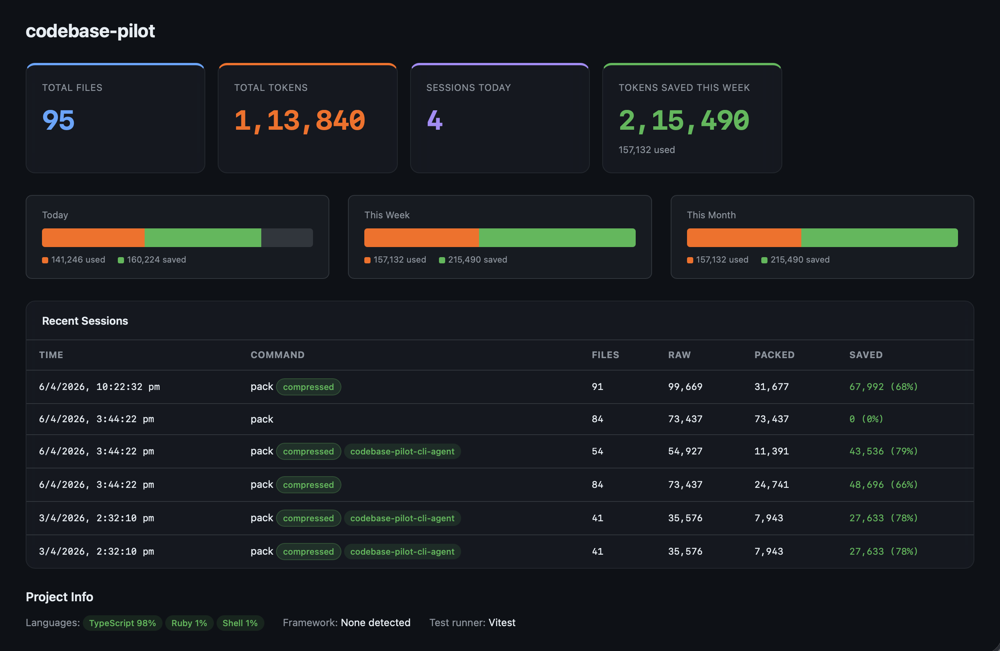
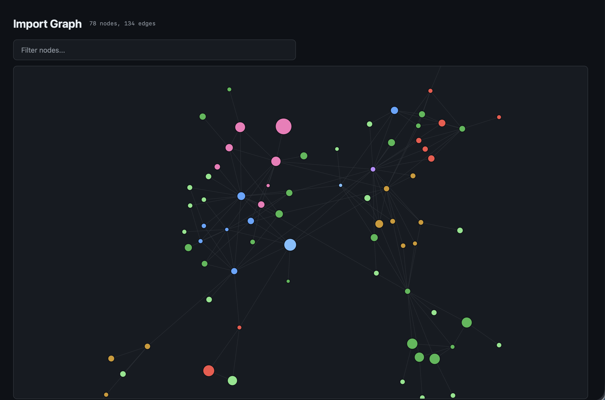
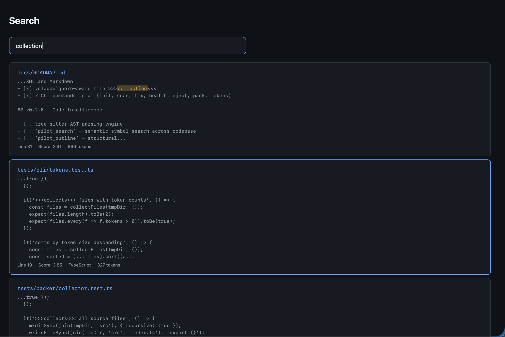
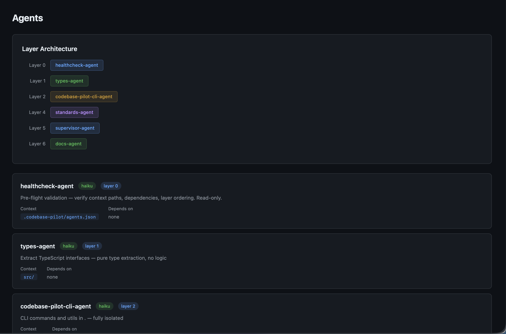
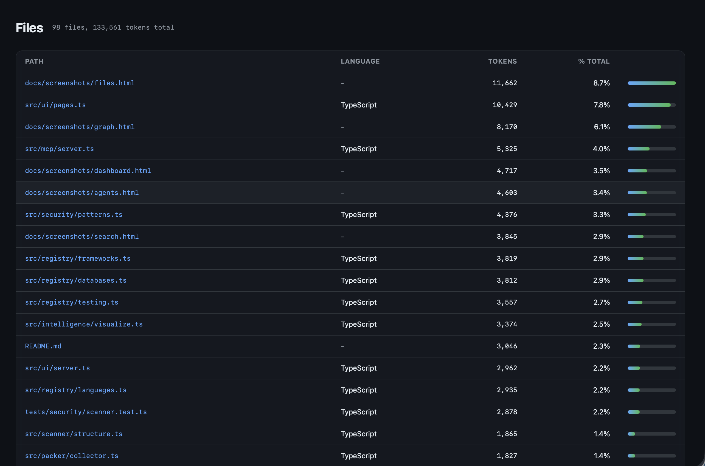

<p align="center">
  <h1 align="center">codebase-pilot</h1>
  <p align="center"><strong>Stop burning tokens. Start coding smarter.</strong></p>
  <p align="center">AI context engine that packs, compresses, and optimizes any codebase for LLMs.<br/>Save 60–90% tokens. Zero cloud. Zero lock-in.</p>
</p>

<p align="center">
  <a href="https://www.npmjs.com/package/codebase-pilot"></a>
  <a href="https://github.com/kalpeshgamit/codebase-pilot/actions/workflows/ci.yml"></a>
  <a href="LICENSE"></a>
  <a href="https://nodejs.org"></a>
</p>

---

## Installation

<table>
<tr><td><strong>npm (recommended)</strong></td><td>

```bash
npm install -g codebase-pilot
```

</td></tr>
<tr><td><strong>npx (no install)</strong></td><td>

```bash
npx codebase-pilot init
```

</td></tr>
<tr><td><strong>Homebrew (macOS)</strong></td><td>

```bash
brew install kalpeshgamit/codebase-pilot/codebase-pilot
```

</td></tr>
<tr><td><strong>Install script</strong></td><td>

```bash
curl -fsSL https://raw.githubusercontent.com/kalpeshgamit/codebase-pilot/main/install.sh | bash
```

</td></tr>
<tr><td><strong>Uninstall</strong></td><td>

```bash
npm uninstall -g codebase-pilot
```

</td></tr>
</table>

## Quick Start

```bash
# Set up any project
codebase-pilot init

# Pack + compress for AI context
codebase-pilot pack --compress --copy

# Web dashboard
codebase-pilot ui    # → http://localhost:7456
```

---

## How It Works

### Architecture Pipeline



**Without codebase-pilot:** Claude reads 98K tokens of your full codebase.
**With codebase-pilot:** 7K tokens — only the relevant, compressed code. No secrets.

### Blast Radius Analysis

When you change a file, codebase-pilot traces the full impact across your codebase:



### Agent Layer Architecture

Agents run in layers — lower layers produce context for higher layers:



### Multi-Platform Support



### MCP Integration Flow



---

## Token Savings

| Approach | Tokens | Reduction |
|----------|-------:|:---------:|
| Manual file reads | ~98K | — |
| `pack` | ~74K | 25% |
| `pack --compress` | ~29K | **70%** |
| `pack --agent <name> --compress` | ~7K | **93%** |

The `tokens` command tracks your actual savings over time:

```
  Savings estimate (per session):
    Without codebase-pilot:   ~98,798 tokens
    With pack --compress:      ~29,274 tokens
    Pilot saves:              ~69,524 tokens per session

  Your savings (from pack runs):
    Today:      3 sessions  — ~92,232 tokens saved
    This week:  5 sessions  — ~147,498 tokens saved
```

---

## Web Dashboard

```bash
codebase-pilot ui          # → http://localhost:7456
codebase-pilot ui --stop   # stop daemon
codebase-pilot ui --status # check status
```

Port **7456** = PILOT on phone keypad. Runs as background daemon with real-time SSE updates.

### Dashboard
Live stat cards, savings chart, recent sessions — auto-updates via SSE.



### Import Graph
Interactive D3.js force-directed graph. Nodes sized by tokens, colored by module. Drag, zoom, search.



### Search
Full-text search with BM25 ranking. Highlighted matches with file path + line number.



### Agents
Layer architecture, model assignment, context paths, dependencies.



### Files
All files with token counts, language tags, percentage of total.



---

## Features

| Feature | Details |
|---------|---------|
| **Pack & Compress** | XML/Markdown output, regex-based compression (8 languages), agent-scoped packing |
| **Security Scanner** | 152 patterns across 15 categories — cloud, payment, AI, crypto, generic |
| **Blast Radius** | Import graph analysis, risk scoring (0-100), affected test detection |
| **Full-Text Search** | SQLite FTS5 with BM25 ranking, snippet extraction, highlighted matches |
| **Web Dashboard** | 6 pages, dark theme, glassmorphism UI, real-time SSE updates |
| **MCP Server** | 10 tools + 3 prompts over stdio — works with Claude Code, Cursor, Zed |
| **Multi-Platform** | Generates CLAUDE.md, .cursorrules, .windsurfrules, AGENTS.md |
| **Agent System** | 7-layer sub-agents with haiku/sonnet/opus model routing |
| **Watch Mode** | Chokidar file watching, debounced re-scan, auto-update configs |
| **Incremental** | SHA-256 hash-based change detection — only re-scans modified files |
| **Visualization** | D3.js interactive force-directed import graph (drag, zoom, search) |
| **Benchmarks** | `eval` command — tokens, compression ratio, import edges, timing |
| **Usage Stats** | Per-project + system-wide savings tracking (today/week/month) |
| **56 Languages** | 3 tiers: 17 full ecosystem, 21 package+test, 18 extension-only |
| **58 Frameworks** | Next.js, Django, Gin, Axum, Spring Boot, Rails, Laravel, and more |
| **39 Test Runners** | Vitest, pytest, Go test, Cargo test, JUnit, RSpec, and more |
| **32 ORMs** | Prisma, SQLAlchemy, GORM, Diesel, Hibernate, ActiveRecord, and more |
| **Config Validation** | Validates agents.json, hooks before writing — prevents invalid configs |
| **Zero Cloud** | No API calls, no accounts, no telemetry. Everything runs locally |

---

## Commands

```
codebase-pilot init [--platform cursor,windsurf,codex]  # scan + generate configs
codebase-pilot scan                                      # re-detect + update
codebase-pilot pack [--compress] [--agent <name>]        # pack for AI context
codebase-pilot tokens [--agent <name>]                   # token breakdown + savings
codebase-pilot impact [--file <path>]                    # blast radius analysis
codebase-pilot search <query>                            # full-text search
codebase-pilot visualize                                 # D3.js import graph HTML
codebase-pilot ui [--stop | --status]                    # web dashboard (port 7456)
codebase-pilot serve                                     # MCP server (stdio)
codebase-pilot watch                                     # file watcher
codebase-pilot stats [--global]                          # usage history
codebase-pilot eval                                      # benchmarks
codebase-pilot health                                    # validate agent setup
codebase-pilot fix                                       # auto-repair stale paths
codebase-pilot eject                                     # remove dependency
```

---

## Blast Radius

Trace the impact of any file change across your codebase:

```bash
codebase-pilot impact --file src/types.ts

  Risk: HIGH (53/100)

  Direct dependents (18):
    src/agents/generator.ts
    src/mcp/server.ts
    src/packer/index.ts
    ...

  Affected tests (5):
    tests/agents/generator.test.ts
    tests/cli/pack.test.ts
    ...

  Total affected: 27 files
```

---

## MCP Server

Expose codebase-pilot to any MCP-compatible AI tool:

```bash
codebase-pilot serve
```

<details>
<summary><strong>10 Tools + 3 Prompts</strong></summary>

**Tools:** `scan_project`, `pack_codebase`, `count_tokens`, `health_check`, `scan_secrets`, `list_agents`, `get_agent`, `detect_languages`, `get_savings`, `list_files`

**Prompts:** `review`, `onboard`, `optimize`

</details>

<details>
<summary><strong>Connect to Claude Code</strong></summary>

```json
{
  "mcpServers": {
    "codebase-pilot": {
      "command": "codebase-pilot",
      "args": ["serve"]
    }
  }
}
```

Same config works for Cursor (`.cursor/mcp.json`) and other MCP clients.

</details>

---

## Security Scanner

152 regex patterns across 15 categories. Runs automatically on every `pack` — files with detected secrets are excluded from output.

<details>
<summary><strong>Categories</strong></summary>

| Category | Examples |
|----------|---------|
| Cloud | AWS, GCP, Azure, DigitalOcean, Supabase, Cloudflare |
| VCS / CI | GitHub, GitLab, Bitbucket, CircleCI, Travis |
| Payment | Stripe, Razorpay, Square, Braintree, Plaid, PayPal |
| AI LLMs | OpenAI, Anthropic, Groq, Perplexity, xAI |
| AI Infra | HuggingFace, Replicate, Together, Fireworks |
| AI DevTools | LangSmith, Pinecone, Weaviate, Qdrant |
| Messaging | Slack, Twilio, SendGrid, Mailgun, Resend |
| Database | MongoDB, PostgreSQL, Redis, PlanetScale, Neon |
| Dev Infra | npm, Docker, Doppler, Vault, PostHog |
| Monitoring | Sentry, Datadog, New Relic, Grafana |
| Crypto | Ethereum, Solana, Bitcoin private keys |
| Crypto Keys | RSA, EC, DSA, OpenSSH, PGP blocks |
| Generic | password=, secret=, api_key=, Bearer tokens |

</details>

---

## Code Compression

Keeps function signatures, folds bodies. Claude still understands the full API surface.

```typescript
// Before (150 tokens)
export async function createUser(data: UserInput): Promise<User> {
  const validated = schema.parse(data);
  const user = await db.user.create({ data: validated });
  await sendWelcomeEmail(user.email);
  return user;
}

// After --compress (20 tokens)
export async function createUser(data: UserInput): Promise<User> { /* ... */ }
```

Supports: TypeScript, JavaScript, Python, Go, Rust, Java, Ruby, PHP.

---

## Benchmarks

```bash
codebase-pilot eval

  Project         Files  Raw tokens  Compressed  Ratio  Edges  Time
  --------------  -----  ----------  ----------  -----  -----  ----
  codebase-pilot     92      98,798      29,274    70%    134  45ms
```

---

## Uninstall

```bash
npm uninstall -g codebase-pilot    # remove CLI
codebase-pilot eject               # remove project configs (optional)
```

---

## Requirements

- Node.js >= 18.0.0

## Contributing

See [CONTRIBUTING.md](docs/CONTRIBUTING.md).

## Security

See [SECURITY.md](SECURITY.md) for vulnerability reporting.

## Author

**Kalpesh Gamit (KG)**
[Website](https://kalpeshgamit.github.io) · [LinkedIn](https://www.linkedin.com/in/kalpeshgamit) · kalpa.hacker@gmail.com

## License

[MIT](LICENSE)

---

<p align="center">
  <strong>Save tokens. Ship faster.</strong><br/>
  <code>npm install -g codebase-pilot</code>
</p>
