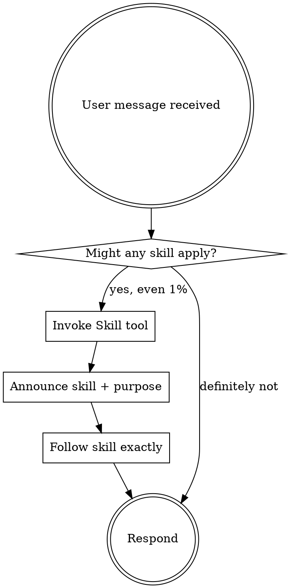

<SUBAGENT-STOP>
If you were dispatched as a subagent to execute a specific task, skip this skill.
</SUBAGENT-STOP>

<EXTREMELY-IMPORTANT>
If you think there is even a 1% chance a skill might apply to what you are doing, you ABSOLUTELY MUST invoke the skill.

IF A SKILL APPLIES TO YOUR TASK, YOU DO NOT HAVE A CHOICE. YOU MUST USE IT.

This is not negotiable. This is not optional. You cannot rationalize your way out of this.
</EXTREMELY-IMPORTANT>

## Instruction Priority

codebase-pilot skills override default system prompt behavior, but **user instructions always take precedence**:

1. **User's explicit instructions** (CLAUDE.md, AGENTS.md, direct requests) — highest priority
2. **codebase-pilot skills** — override default system behavior where they conflict
3. **Default system prompt** — lowest priority

## How to Access Skills

**In Claude Code:** Use the `Skill` tool. Invoke with `codebase-pilot:<skill-name>`.

Example: `Skill("codebase-pilot:brainstorming")`

## Available Skills

### Context & Tooling (codebase-pilot native)
- `codebase-pilot:pilot-check` — Full health check (pack + secrets + compare)
- `codebase-pilot:pack-context` — Pack codebase into AI-friendly format
- `codebase-pilot:scan-secrets` — Scan for leaked secrets
- `codebase-pilot:impact-analysis` — Blast radius of file changes
- `codebase-pilot:token-budget` — Token count per file, context planning

### Workflow Skills
- `codebase-pilot:using-codebase-pilot` — This skill (invoke at session start)
- `codebase-pilot:brainstorming` — Turn ideas into designs and specs
- `codebase-pilot:writing-plans` — Write implementation plans from specs
- `codebase-pilot:executing-plans` — Execute a written plan task-by-task
- `codebase-pilot:test-driven-development` — TDD: red-green-refactor cycle
- `codebase-pilot:systematic-debugging` — Root cause investigation before fixes
- `codebase-pilot:subagent-driven-development` — Fresh subagent per task with two-stage review
- `codebase-pilot:dispatching-parallel-agents` — Dispatch independent agents concurrently
- `codebase-pilot:finishing-a-development-branch` — Complete dev branch: verify, PR, merge
- `codebase-pilot:requesting-code-review` — Request code review with proper context
- `codebase-pilot:receiving-code-review` — Handle review feedback systematically
- `codebase-pilot:verification-before-completion` — Pre-completion quality checklist
- `codebase-pilot:using-git-worktrees` — Git worktree management for parallel dev
- `codebase-pilot:writing-skills` — Create new skills following established patterns

## The Rule

**Invoke relevant or requested skills BEFORE any response or action.** Even a 1% chance a skill might apply means you must invoke it first. If an invoked skill turns out to be wrong for the situation, you do not need to use it.



## Skill Priority

When multiple skills could apply, use this order:

1. **Process skills first** (brainstorming, systematic-debugging) — determine HOW to approach the task
2. **Implementation skills second** (test-driven-development, executing-plans) — guide execution

"Let's build X" → brainstorming first, then writing-plans.
"Fix this bug" → systematic-debugging first, then test-driven-development.

## Red Flags — STOP, you are rationalizing

| Thought | Reality |
|---------|---------|
| "This is just a simple question" | Questions are tasks. Check for skills. |
| "I need more context first" | Skill check comes BEFORE clarifying questions. |
| "Let me explore the codebase first" | Skills tell you HOW to explore. Check first. |
| "I can check git/files quickly" | Files lack conversation context. Check for skills. |
| "This doesn't need a formal skill" | If a skill exists, use it. |
| "I remember this skill" | Skills evolve. Read current version via Skill tool. |
| "The skill is overkill" | Simple things become complex. Use it. |
| "I'll just do this one thing first" | Check BEFORE doing anything. |
| "This doesn't count as a task" | Action = task. Check for skills. |

## Skill Types

**Rigid** (test-driven-development, systematic-debugging): Follow exactly. Do not adapt away discipline.

**Flexible** (brainstorming, writing-plans): Adapt principles to context.

The skill itself tells you which type it is.

## codebase-pilot MCP Tools

When the MCP server is running (`codebase-pilot serve`), these tools are available directly:
- `pack_codebase` — Pack and compress codebase (auto-tracks tokens)
- `scan_secrets` — Security scan (179 patterns across 15 categories)
- `health_check` — Validate agent setup and context paths
- `count_tokens` — Token breakdown per file
- `scan_project` — Detect languages, frameworks, databases
- `impact_analysis` — Blast radius of file changes
- `list_agents` / `get_agent` — Agent configuration from agents.json

## codebase-pilot CLI Quick Reference

```bash
codebase-pilot pack --compress          # Pack + compress (~70% token reduction)
codebase-pilot pack --compress --agent <name>  # Pack only one agent's context
codebase-pilot impact --file <path>     # Blast radius of a file
codebase-pilot scan-secrets             # Security scan
codebase-pilot health                   # Validate agents.json setup
codebase-pilot tokens                   # Token count per file
```
